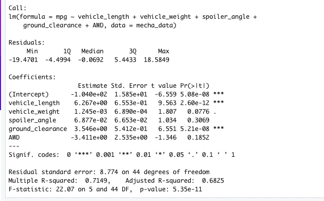
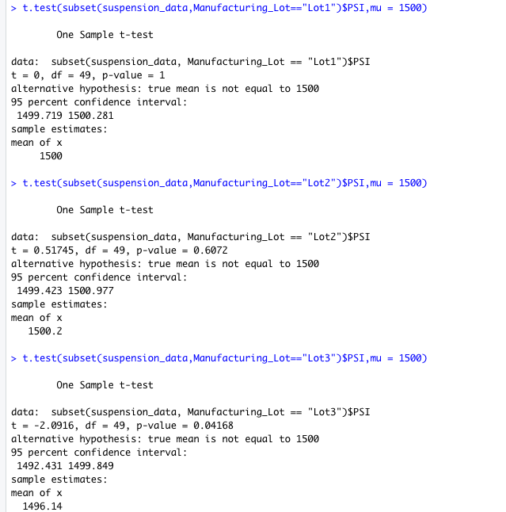

# MechaCar_Statistical_Analysis-
## Linear Regression to Predict MPG

1. The vehicle length, and vehicle ground clearance are statistically likely to provide non-random amounts of variance to the model.
2. The p-Value for this model, p-Value: 5.35e-11, is much smaller than the assumed significance level of 0.05%. This indicates there is sufficient evidence to reject our null hypothesis, which further indicates that the slope of this linear model is not zero.
3. This model does predict mpg of MechaCar prototypes effectively. We can tell this because the linear model has an r-squared value of 0.7149, which means that approximately 71% of all mpg predictions will be determined by this model

## Summary Statistics on Suspension
When we look at the total data the overall calculated variance is within specifications. That said when we look at each lot by themself. We see that lot 1(.98) and 2(7.47) are under the 100 PSI. However, lot 3 is over it at 170.29.

## T-Tests on Suspension Coils

When you are looking at the t-test from each lot you will see 1 and 2 are again within and lot 3 is not. Lot 1 and 2 are not below the common significance level of 0.05. We can see that lot 3 is below it at .04 which means the should do more testing on lot 3 to find out what is causing these results.

## Study Design: MechaCar vs Competition
### Metric
One metric that is becoming more and more important to people is the tow capacity of vechicles. This is important because people are doing more things out doors where they are towing things. We can create a study to see MechaCar and comparable vehicals compare. Along with tow weight we would want to look at hitch weight, gross vechicle weight, and load capacity. 
### Hypothesis: Null and Alternative
 Null Hypothesis: MechaCar has a comparable or better tow weight based on its performance of key factors for its genre.
 Alternative Hypothis: MechaCar does not have a comparable or better tow weight based on its performance of key factors for its genre.
### Statistical Tests
We could use a multiple linear regression to figure out what factors have the highest correlation to the tow weight. 
